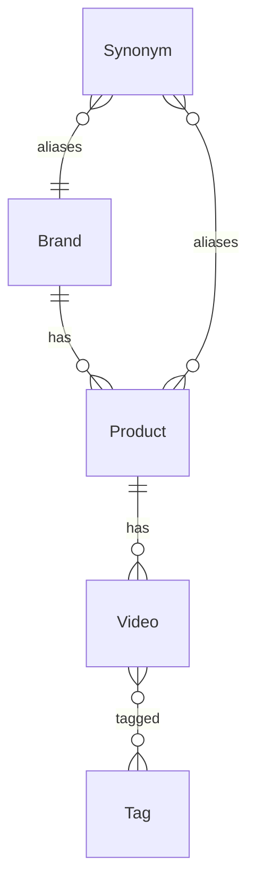
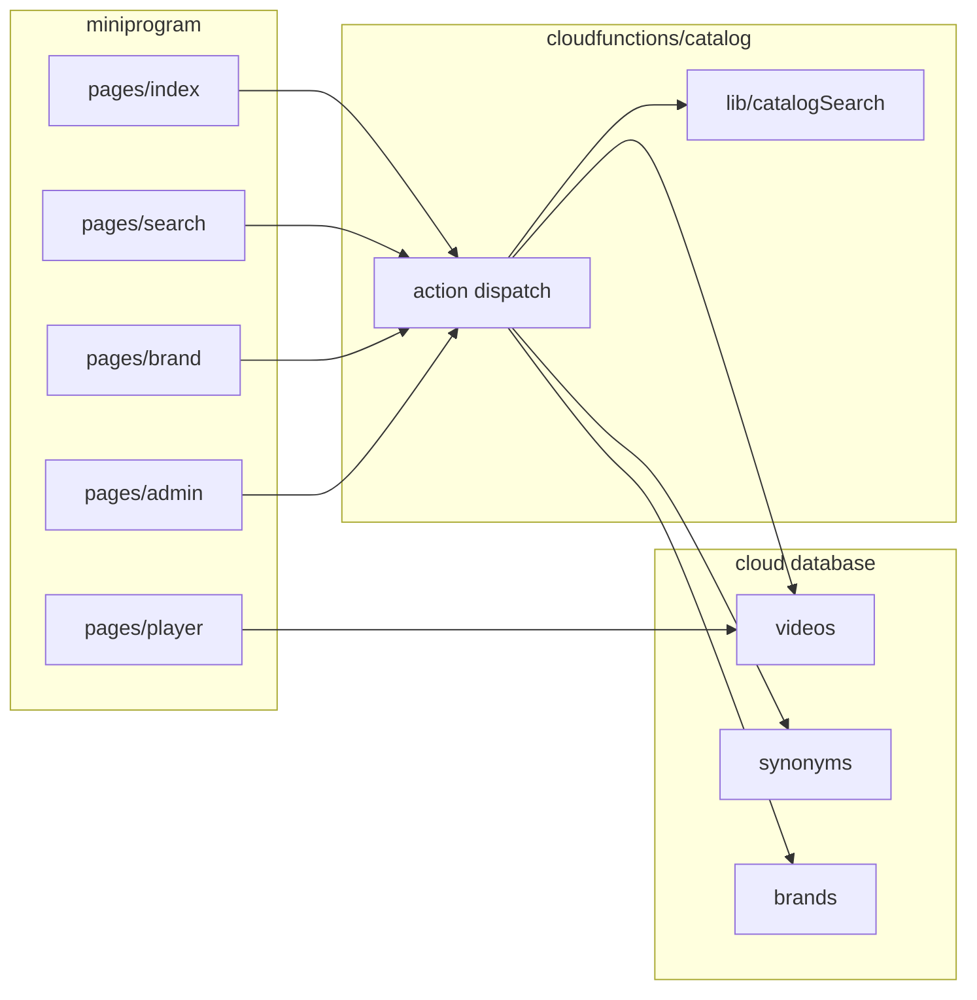

# Survey Instrument Mini Program Catalog Search - Plan

## Goal Capsule

- **Objective:** 交付微信小程序第一期：测绘仪器讲解/介绍视频的结构化目录、后台边采边入库、以及关键词级基础搜索（含品牌/型号筛选）。
- **Product authority:** 本计划只覆盖第一期目录与基础搜索。AI 语义搜索、排序模型、个性化均不是本计划范围。
- **Execution profile:** 从空仓库搭原生微信小程序 + 微信云开发。无现成业务代码可复用。
- **Stop conditions:** 搜索路径出现任何大模型或向量调用即超出范围。未配置 AppID/云环境时不得假装已上线，只交付可导入微信开发者工具的工程与 README。
- **Open blockers:** 无。AppID、云环境 ID、运营口令在执行时由运营填入本地配置，不写入仓库。
- **Product Contract preservation:** Product Contract unchanged.

---

## Product Contract

### Summary

做一个面向测绘从业者的微信小程序，用结构化目录承载华测、中海达等品牌的仪器讲解与介绍视频；运营可在视频仍在采集时持续入库。第一期搜索是传统关键词与筛选，不接大模型。

### Problem Frame

测绘仪器视频按品牌、型号、用途分散，用户常带着「某品牌某机型某操作」来找片。视频还在采集，若等片源齐了再定结构，搜索会绑在标题字符串上，后续无法加语义层。第一期要把「能被找到」建立在稳定的目录字段上，而不是一次做完搜索 3.0。

### Key Decisions

- Phase 1 只做基础搜索，不做 AI 搜索。 (session-settled: user-directed — chosen over 同期上线两级搜索: 先把目录与关键词检索跑通，语义层留到后续优化)
  Governs R8, R9, R17.
- 技术底座用微信云开发（云数据库、云存储、云函数），并配套管理端以便边录边入库。 (session-settled: user-directed — chosen over 自建后端: 降低第一期运维面，适合片源未齐)
  Governs R10, R11, R12.
- 后续语义搜索只把美团搜索 3.0 文当作演进参考，不在第一期复制其精排/表征体系。 (session-settled: user-approved — chosen over 第一期直接上 LLM 表征: 该文依赖大规模行为日志与精排，当前没有等价数据)
  Governs R17.



<!-- ce-section: work-relationships -->
### How This Work Fits Together

本计划拥有「目录入库 + 基础搜索」这一块。下面是当前对周边工作的理解，不是已承诺路线图。

- 后续：AI / 语义搜索（查询改写、视频摘要向量、召回后再排）
  - Depends on 本计划的品牌/型号/标签/标题等可检索字段稳定落地
  - Shares 同一视频目录，不另建内容库
  - 演进顺序参考美团搜索从关键词匹配到语义表征再进排序的路径，而不是跳过 1.0
- 后续：讲解体系扩容（更多品牌、系列课、章节）
  - Can proceed independently of 搜索算法，只要继续使用同一目录字段
- Still to decide：视频号作为播放源还是仅云存储文件；不阻塞第一期用云存储先播起来

### Actors

- A1. 测绘从业者（C 端）：在小程序里浏览、筛选、搜索并观看视频。
- A2. 内容运营（管理端）：在片源未齐时创建品牌/型号、上传或登记视频、维护标签与同义词。
- A3. 微信云开发：存目录数据、存视频文件、执行检索云函数。

### Requirements

**目录与入库**

- R1. 每条可检索内容是一条视频记录，必须挂到一个品牌，并尽量挂到一个具体型号/系列；没有型号时允许只挂品牌并在列表中可筛出。
- R2. 第一期至少覆盖运营可维护的品牌：华测、中海达；结构上允许后续增加品牌而不改搜索交互。
- R3. 视频记录至少包含：标题、品牌、型号或系列（可空）、用途/主题标签、简介、封面、播放地址、发布状态（草稿/已上架）。
- R4. 运营可在管理端创建或编辑品牌、型号、视频、标签，无需等全部视频拍完再开放小程序搜索。
- R5. 草稿不对 C 端可见；仅已上架视频出现在列表与搜索结果中。

**浏览与筛选**

- R6. C 端可按品牌进入列表，并可在品牌下按型号或标签收窄。
- R7. 无搜索词时，首页或发现页展示已上架视频的品牌入口与最近上架列表。

**基础搜索**

- R8. 用户输入关键词后，在已上架视频的标题、简介、品牌名、型号名、标签上做包含匹配（不区分大小写）。
- R9. 同义词参与匹配：例如品牌俗称、英文名、常见缩写映射到同一品牌或型号，命中后返回对应视频。
- R10. 检索在云函数中执行，小程序不直连拼出全库扫描逻辑以外的密钥；云环境凭证不进入前端代码。

**管理与存储**

- R11. 视频文件默认上传到微信云存储（或云开发认可的视频托管），管理端保存可播放的 fileID 或 HTTPS 地址。
- R12. 管理端需登录保护，仅授权运营可改目录。

**体验与安全**

- R13. 搜索无命中时展示空状态，并提示可换品牌名、型号或操作关键词；不出现「去 AI 搜」入口。
- R14. 播放页展示标题、品牌、型号、标签与简介，并使用小程序视频组件播放。
- R15. 用户上传与展示的文案、封面走微信内容安全能力（文本/图片检测），不通过检测的不得上架。
- R16. 搜索结果按相关度粗排：标题完全包含 > 型号/品牌命中 > 仅标签或简介命中；同分按上架时间新到旧。

**明确不做（本计划）**

- R17. 第一期不调用大模型、不做向量召回、不做查询改写、不根据点击日志训练排序模型。

### Key Flows

- F1. 边采边入库
  - **Trigger:** 运营拿到一条新讲解视频。
  - **Actors:** A2, A3
  - **Steps:** 确认或创建品牌与型号；填标题、标签、简介；上传视频与封面；保存为草稿；预览无误后改为已上架。
  - **Outcome:** C 端列表与搜索立刻能命中该条（R4, R5）。
  - **Covered by:** R1, R3, R4, R5, R11

- F2. 关键词找片
  - **Trigger:** 用户在搜索框输入如「中海达 RTK 对中」。
  - **Actors:** A1, A3
  - **Steps:** 提交查询；云函数用词面与同义词匹配已上架视频；按 R16 排序返回卡片列表；用户点进播放页观看。
  - **Outcome:** 有匹配则列表；无匹配则空状态且无 AI 入口（R13）。
  - **Covered by:** R8, R9, R10, R13, R14, R16

- F3. 品牌下钻
  - **Trigger:** 用户从首页点「华测」或「中海达」。
  - **Actors:** A1
  - **Steps:** 进入该品牌已上架列表；可选型号或标签再筛；点开播放。
  - **Outcome:** 不依赖搜索词也能按目录找到片。
  - **Covered by:** R6, R7

### Acceptance Examples

- AE1. 型号写在标签里也能搜到
  - **Covers R8, R9.**
  - **Given:** 已上架视频标题为「主机架设」，型号字段为「iRTK5」，同义词「中海达」绑定该品牌。
  - **When:** 用户搜「中海达 iRTK5」。
  - **Then:** 该视频出现在结果中。

- AE2. 草稿不可搜
  - **Covers R5, R8.**
  - **Given:** 同内容一条草稿、一条已上架。
  - **When:** C 端搜索该标题关键词。
  - **Then:** 只返回已上架那条。

- AE3. 无结果不引导 AI
  - **Covers R13, R17.**
  - **Given:** 词库中无「全站仪校准动画」。
  - **When:** 用户搜索该词。
  - **Then:** 空状态文案只建议换词或按品牌浏览，不出现 AI 搜索按钮或第二搜索框。

- AE4. 新品牌可加
  - **Covers R2, R4.**
  - **Given:** 运营新增品牌「南方测绘」并上架一条视频。
  - **When:** C 端打开品牌列表并搜索该品牌名。
  - **Then:** 品牌入口与搜索均可到达该视频，无需改搜索页交互。

### Success Criteria

- 运营能在不上线新版本的前提下，靠管理端把新视频送进可搜索目录。
- 用户用品牌名、型号名或标题中的词能在 3 秒内看到结果或明确空状态（弱网除外）。
- 规划与实现不得把 LLM 调用塞进第一期搜索路径。

### Scope Boundaries

**Deferred for later**

- AI 二级搜索：自然语言问句、视频口播/字幕摘要、向量召回、语义相似度进排序。
- 美团文中的精排模型、特殊 Token 表征、点击/下单分桶特征、个性化。
- 视频号动态拉取、课程目录、学习进度、评论。

**Outside this product's identity**

- 仪器电商交易、维修工单、非测绘品类综合搜索。

### Dependencies / Assumptions

- 微信小程序与云开发账号可用；视频版权由运营自行保证。
- 第一期视频体量按百级到千级设计，词面检索可接受；达到需要倒排或独立搜索服务时另开计划。
- 播放走小程序 `<video>`。超大文件压缩规范见 Outstanding Questions。

### Outstanding Questions

**Deferred to implementation**

- 小程序对外展示名称、类目、是否开通订阅消息（不阻塞目录与搜索）。
- 单条视频超过云存储/小程序播放限制时的压缩规范（执行时按微信当前限额写进 README）。

### Sources / Research

- 后续语义层参考（非第一期实现规范）：[美团搜索 3.0：LLM 语义表征在排序模型的探索与应用](https://mp.weixin.qq.com/s/QAnbNhmRBz40kkq9l5xTjQ)。可迁移的是「先关键词 1.0，有日志与稳定目录后再加语义特征」；不可迁移的是其千万级样本精排与 64 维表征分桶注入。
- 云数据库词面查询使用 `db.RegExp`（`i` 忽略大小写）：[Database.RegExp](https://developers.weixin.qq.com/miniprogram/dev/wxcloudservice/wxcloud/reference-sdk-api/database/Database.RegExp.html)。

---

## Planning Contract

### Key Technical Decisions

- KTD1. 原生微信小程序，不用 uni-app / Taro。 (session-settled: user-directed — chosen over 跨端框架: 第一期只有微信，少一层构建)
  Instantiates cloud-base product decision; Governs R10.

- KTD2. 运营端做小程序内隐藏页面，不用独立 Web 后台。 (session-settled: user-directed — chosen over 独立网页后台: 同一云环境和同一套集合，边采边入库路径最短)
  Instantiates R12.

- KTD3. 运营鉴权用云函数校验环境变量口令，签发短时票据；票据只存客户端 storage，口令不进仓库。 (session-settled: user-directed — chosen over 微信登录白名单: 第一期运营人数极少)
  Instantiates R12.

- KTD4. 视频与封面上传云存储，播放用临时链接或 cloud:// fileID；第一期不用云点播。 (session-settled: user-directed — chosen over 云点播: 片源未齐，先通播放再转码)
  Instantiates R11.

- KTD5. 写路径全部走单一云函数 `catalog` 的 action 分发；C 端只读已上架记录。共享模块负责 searchBlob、同义词展开与 R16 打分，避免两套逻辑。
  Instantiates R8, R9, R10, R16.

- KTD6. 每条视频写入时维护小写 `searchBlob`（标题、简介、品牌名、型号名、标签名拼接）。检索先展开同义词再按空白分词，词项对 searchBlob 做包含匹配。
  Instantiates R8, R9.

- KTD7. 同义词进 `synonyms` 集合，种子含华测/CHCNAV、中海达/Hi-Target 等；运营可在管理端增改。
  Instantiates R9, R2.

- KTD8. 上架前云函数调微信内容安全接口检测标题、简介与封面；不通过则保持草稿并返回原因。
  Instantiates R15.

### High-Level Technical Design

组件关系：小程序页面只调 `wx.cloud.callFunction({ name: 'catalog', data: { action } })` 与云存储上传。`catalog` 读写 `brands`、`products`、`videos`、`synonyms`。C 端列表查询带 `status: published`。搜索不在小程序里扫全库。



搜索协议（方向性，非实现规格）：客户端只传原始 query 与可选 brandId。服务端规范化、展开同义词、过滤 `published`、打分排序后返回卡片字段。不得把运营口令或未上架记录带回 C 端 action。

写入协议：`upsertVideo` 先组 searchBlob，草稿可跳过内容安全；`publish` 必须内容安全通过后改 status。

### Assumptions

- 运营能使用微信开发者工具上传云函数并在控制台配置 `ADMIN_PIN`。
- 第一期并发低，云函数内对已上架视频做内存打分可接受（体量见 Product Contract 千级假设）。

### Risks and Dependencies

- 内容安全接口需要在小程序后台开通对应权限；未开通时 U2 上架会失败，README 必须写开通步骤。
- 云存储单文件与小程序 `<video>` 有大小限制；超限时运营需先压缩，不在第一期做转码服务。
- 口令方案防不住会分享管理页路径的内部人员；运营人数变多时再换成微信登录白名单。

### Implementation Constraints

- 密钥、AppID、云环境 ID、口令只出现在 `project.config.json` 本地、`cloudbaserc` 忽略文件或云控制台，不提交真实值。
- 仓库可提交 `project.config.json` 占位与 `README.md` 配置步骤。
- 搜索与打分纯函数必须可在 Node 下单测，不依赖微信运行时。

### Sequencing

U1 脚手架与集合规则 → U2 运营写入与安全 → U3 C 端浏览播放 → U4 搜索（依赖 U1 的 catalogSearch 与 U2 的 searchBlob）→ U5 种子数据与 README 手测清单。

### Output Structure

```
README.md
project.config.json
miniprogram/app.js
miniprogram/app.json
miniprogram/pages/index/
miniprogram/pages/search/
miniprogram/pages/brand/
miniprogram/pages/player/
miniprogram/pages/admin/login/
miniprogram/pages/admin/home/
miniprogram/pages/admin/edit/
cloudfunctions/catalog/index.js
cloudfunctions/catalog/lib/catalogSearch.js
cloudfunctions/catalog/lib/catalogSearch.test.js
cloudfunctions/catalog/package.json
```

---

## Implementation Units

### U1. Scaffold miniprogram and cloud catalog

- **Goal:** 可在微信开发者工具打开的空业务骨架：云能力初始化、tab/页面路由、`catalog` 云函数 ping、数据库集合与安全规则草稿。
- **Requirements:** R10
- **Files:** `project.config.json`, `miniprogram/app.js`, `miniprogram/app.json`, `cloudfunctions/catalog/index.js`, `cloudfunctions/catalog/package.json`, `README.md` (env placeholders only)
- **Approach:** 原生小程序目录。`app.js` 里 `wx.cloud.init`。云函数先实现 `action: ping`。数据库集合名固定为 `brands`、`products`、`videos`、`synonyms`。权限：客户端只读 `videos` 中 `status == published`；写操作仅云函数。KTD1, KTD5.
- **Dependencies:** none
- **Test scenarios:**
  - **Happy path:** 开发者工具编译成功；调用 ping 返回 ok。
  - **Error path:** 未配云环境时 README 写明控制台报错含义，代码不硬编码他人环境 ID。
- **Verification:** 开发者工具编译无报错；README 含「创建云环境 / 上传云函数」步骤。
- **Execution note:** 先通云函数再写页面。

### U2. Admin ingest and publish

- **Goal:** 运营用口令进入隐藏管理页，维护品牌/型号/视频/同义词，上传封面与视频，草稿与上架符合 R5 与 R15。
- **Requirements:** R1, R2, R3, R4, R5, R11, R12, R15
- **Files:** `miniprogram/pages/admin/login/`, `miniprogram/pages/admin/home/`, `miniprogram/pages/admin/edit/`, `cloudfunctions/catalog/index.js` (admin actions), `cloudfunctions/catalog/lib/buildSearchBlob.js`
- **Approach:** 入口不放 tab，用路径或首页长按手势进入登录（README 写明路径）。`adminLogin` 校验 `ADMIN_PIN` 后发票据。`upsert*` 校验票据。发布前内容安全检测。写入时调用 buildSearchBlob。KTD2, KTD3, KTD4, KTD6, KTD7, KTD8. F1.
- **Dependencies:** U1
- **Test scenarios:**
  - **Happy path:** 口令正确后可新建华测品牌、上传草稿、检测通过后上架。
  - **Edge:** 无型号仅品牌的视频可保存（R1）。
  - **Error:** 口令错误不发票据；内容安全失败保持草稿。
  - **Integration:** 上架后 C 端只读查询能看到；草稿查询看不到（AE2 数据准备）。
- **Verification:** 真机或模拟器走完 F1；错误口令无法 upsert。

### U3. Consumer browse and play

- **Goal:** 首页品牌入口与最近上架、品牌下型号/标签筛选、播放页字段与 `<video>`。
- **Requirements:** R6, R7, R14
- **Files:** `miniprogram/pages/index/`, `miniprogram/pages/brand/`, `miniprogram/pages/player/`
- **Approach:** 列表走云函数 `listPublished`（可按 brandId、productId、tag 过滤），不在前端拼未授权查询。播放页用临时文件链接。F3. AE4 的品牌入口来自 `brands` 集合而非写死两个按钮（可种子两个品牌）。
- **Dependencies:** U2
- **Test scenarios:**
  - **Happy path:** 点华测进入列表，点卡片进入播放，标题品牌型号标签简介可见。
  - **Edge:** 某品牌下无视频时空列表文案，不是报错页。
  - **Integration:** 运营新增「南方测绘」上架后首页出现该品牌且可进入（AE4）。
- **Verification:** 模拟器播放本地云存储样例（短视频）；字段与 R14 一致。

### U4. Keyword search

- **Goal:** 搜索页调用 catalog search，同义词与 R16 排序，空状态无 AI 入口。
- **Requirements:** R8, R9, R10, R13, R16, R17
- **Files:** `miniprogram/pages/search/`, `cloudfunctions/catalog/lib/catalogSearch.js`, `cloudfunctions/catalog/lib/catalogSearch.test.js`
- **Approach:** `catalogSearch.js` 纯函数：展开同义词、分词、过滤 published、打分。云函数 action `search` 读库后调用该模块。UI 无第二搜索框、无 AI 文案。KTD5, KTD6, KTD7. F2. 禁止引入任何 LLM SDK。
- **Dependencies:** U1, U2
- **Test scenarios:**
  - **Happy path / AE1:** 样本 video searchBlob 含 irtk5 与品牌中海达；query「中海达 iRTK5」经同义词展开后命中。
  - **AE2:** published 与 draft 同标题，结果只有 published。
  - **AE3:** 无命中返回空数组；页面文案无「AI」。
  - **R16:** 标题全包含的条目排在仅标签命中之前；同分比较 publishedAt 新到旧。
  - **Error:** 空 query 不扫库，提示输入关键词或回首页。
- **Verification:** 在 `cloudfunctions/catalog` 运行 `node --test lib/catalogSearch.test.js`；模拟器手测搜索页。

### U5. Seeds and operator README

- **Goal:** 种子华测、中海达及常用别名；README 覆盖上传云函数、配口令、管理页路径、手测清单。
- **Requirements:** R2, R9
- **Files:** `README.md`, `cloudfunctions/catalog/seed.json` or seed action
- **Approach:** 一次性 seed action（需票据）或文档中的控制台导入步骤。不把口令写入 seed。
- **Dependencies:** U2, U4
- **Test expectation:** none -- 文档与种子，行为已由 U2/U4 覆盖。手测清单必须列出 AE1–AE4。
- **Verification:** 按 README 可从零开通云开发并完成手测清单。

---

## Verification Contract

- 匹配与排序：`node --test cloudfunctions/catalog/lib/catalogSearch.test.js`（覆盖 AE1 数据形态、R16 序、draft 过滤）。
- 微信侧：开发者工具编译；上传 `catalog` 云函数；模拟器走 F1–F3 与搜索空状态。
- 发布前抽查：C 端网络面板无 ADMIN_PIN；搜索响应不含 draft 记录。
- 无小程序官方 CI 时，不以「启动微信开发者工具」作为自动化门禁；Node 单测是可重复门禁。

---

## Definition of Done

- U1–U5 均完成；R1–R17 均可在手测或单测中指出对应证据。
- Product Contract 中的 Deferred for later 未实现，且代码中无 LLM 调用。
- 仓库无真实 AppSecret、口令、云密钥。
- 弃用的实验页面与死云函数已删除。
- README 足以让未参与对话的人配好云环境并入库第一条视频。
