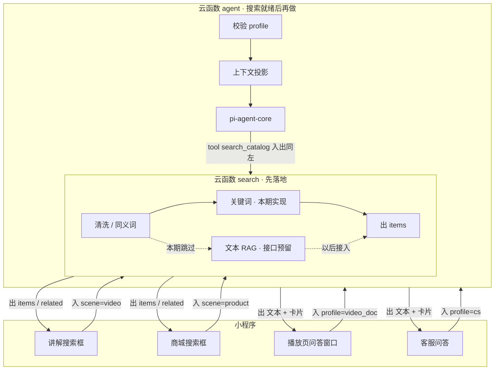
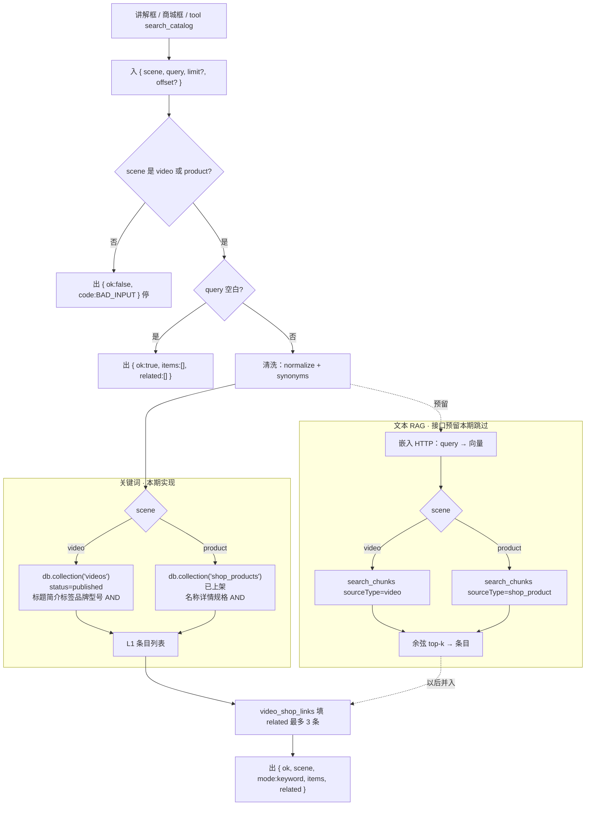

# 统一搜索（先）与 AI 问答（后）

待入库。搜索本期 **只做关键词**；文本 RAG **路径与接口预留，暂不实现**。通过前仍不写业务代码。  
分支：`dev-ai-search`（从 `dev` 迁出）  
对照：总 spec / REQ-005～007。设计覆盖搜索 + 两种 AI 问答；**落地仍先** `search`（先 L1），**再** `agent`**。**

## 图一：搜索+AI问答总图

两条进线：搜索框只进 `search`；问答进 `agent`，需要找片/找货时再 **tool 打回已经落地的** `search`（同一套 I/O）。`search` 不跑 pi-agent-core。

本期实现图左的 **清洗 + 关键词**；图中 RAG 虚线只占位。问答设计在本文，代码在下一分支。

### 图二：云函数 `search` 内部信息流（先落地）

调用方三种：讲解框、商城框、日后 `search_catalog`；入参形状相同。实线为本期；虚线为 RAG 预留，本期不跑嵌入、不读 `search_chunks`。

本期 `mode` 固定 `keyword`。以后接上 L2 再出现 `merged`。调用方字段不变。kb 块不进 `items`。不跑 pi-agent-core。

---

## 1. 为什么先搜索

AI 问答（播放页 + 客服）会调 tool。若没有统一 `search`，两套问答会各写一套检索，和「AI Native：底层一套、对人是接口、对 Agent 是 tool」相反。所以：**先把图中间的** `search` **落地，再接** `agent`**。**

`catalog` 继续管品牌/视频入库。C 端搜索不再走 `catalog.search`。

---

## 2. 关于两个搜索框：主信息流的输入 / 输出

条目统一形状（搜索框和 Agent tool 相同）：

`{ type: 'video' | 'shop_product', id, title, coverFileId, summary, score? }`

### 2.1 搜索框 → `search`（图左整块）

讲解搜索框：**用户点搜索 → 小程序调云函数** `search` **→ 用返回的** `items` **画列表**。不进 `agent`，没有模型对话。商城框同一条路，只是 `scene` 不同。

|     |                                                                 |
| --- | --------------------------------------------------------------- |
| 入   | `{ scene: 'video' \| 'product', query, limit?, offset? }`        |
| 出   | `{ ok, scene, mode: 'keyword', items[], related[] }` |

`items[]`：`{ type, id, title, coverFileId, summary, score? }`  
`related[]`：附属推荐，最多 3 条（`video` 时放商品，`product` 时放视频）。

### 2.2 `search` 内部

本期：**清洗 → 关键词 L1 → 填 `related` → 返回**。逻辑放在 `search` 云函数内（从现网 `catalogSearch.js` 复制或抽 lib，禁止 `search` require `catalog` 目录）。

**清洗：** `normalize`（去空白、小写）→ `synonyms` 扩展得到 `tokens[]`。空 query：空 `items`，不报错。本期不跑 embedding。

#### 第一级：关键词（本期实现）

现网路径：`normalize` → `synonyms` 扩展 → 字段 blob **AND** 匹配 → 标题/品牌型号加权。

只扫 C 端可见数据，字段随 `scene`：

- `video`：标题、简介、标签、`brandName`、`modelName`；已有则纳入 `searchAbstract` / `transcript*`（运营不强制转写才能上架）。
- `product`：名称、详情文案、规格、分类（集合不存在则本级为空）。

`tokens` 全部出现在 blob 中才命中。标题全匹配权重大于只中品牌/型号，再按 `publishedAt`。

| | |
| --- | --- |
| 入 | `tokens[]` + 上架记录字段 |
| 出 | 命中条目列表（与 §2.1 条目形状相同） |

读源表失败 → `ok: false`，禁止装成空库。成功但 0 条 → `ok: true`，空 `items`。
`related`：关联表最多 3 条已上架；无表则 `[]`。本期无 L2，不必与 RAG 合并。

#### 第二级：文本 RAG（接口预留，本期不实现）

图二虚线。不接嵌入 HTTP、不建/不查 `search_chunks`、不把 L2 并进 `items`。调用方入参出参不变，以后在同一 `search` 里接上即可。

以后接入时（现在不写代码）：入库与查询分开；query 嵌入 → top-k → 与 L1 按 `type+id` 去重，`mode` 可为 `merged`。预留约定：

| 来源 | chunk 内容 | 不存 |
| --- | --- | --- |
| 已上架视频 | 标题、简介、标签、品牌/型号；有则加 `searchAbstract` / 转写 | 视频文件、帧、音频 |
| 已上架 `shop_products` | 名称、详情、规格、分类 | 主图二进制 |
| 领域知识库 | 运营整理的说明文档切块 | 整段教学视频 |

预留集合 `search_chunks`：`sourceType`（`video` | `shop_product` | `kb`）、`sourceId`、`text`、`embedding`、`published`、`updatedAt`。`kb` 不进搜索框 `items`。

| | |
| --- | --- |
| 入 | 清洗后 query 的 embedding |
| 出 | 语义命中条目列表（形状同 L1） |

嵌入模型、L1 故障 vs L2 有结果、RRF：做 RAG 时再拍，见 §5 第 2～4 条。

---

## 3 关于问答Agent（觉得字多的话本期可以先不review此部分..）

### 3.1 问答入口 → `agent`（图右整块）

小程序不跑循环，只把这一轮交给云函数。

| 来源     | 入 `agent`                                                                      | 出回页面                                |
| ------ | ------------------------------------------------------------------------------ | ----------------------------------- |
| 播放页窗口  | `{ profile: 'video_doc', message, videoId, currentTimeSec? }`，`videoId` 由当前页带上 | `{ text, cards[] }`，`cards` 可点视频/商品 |
| 客服 tab | `{ profile: 'cs', message }`                                                   | 同上；转人工后本轮可只有系统句，不再出 AI 气泡           |

`profile` 非法、或缺 `videoId`（仅 `video_doc`）→ `BAD_INPUT`，不调模型。

### 3.2 `agent` 内部（图中校验 / 投影 / 内核）

| 环节            | 入                           | 出                                                          |
| ------------- | --------------------------- | ---------------------------------------------------------- |
| 校验            | 原始请求                        | 合法 profile + 会话键；否则直接错误                                    |
| 上下文投影         | profile、会话键、本轮 `message`、历史 | system + 本轮非对话材料 + 允许的 tools                               |
| pi-agent-core | 投影结果                        | 助手 `text` / `cards`；需要找片找货时调用 `search_catalog`（I/O = §2.1） |

`search` 未就绪时不要接 `agent`：内核会空转或再写一套检索。信息流上是 **先有左图出参，右图的 tool 才能接到同一个口**。

### 3.3 上下文中枢与 profile 一览

所有进 `agent` 的请求带 `profile`（总图里问答侧的入参；不要和搜索框的 `scene=video|product` 混用）。中枢按 profile **投影** 成：system 片段 + 本轮附加材料 + 允许的 tools，交给同一个 pi-agent-core，不在业务里手写生成循环。不接文件 / shell 类 tool。播放页会话和客服会话不合并。

| profile                      | 入口                        | 会话键                | 注入材料                                                  | tools                                                                                               |
| ---------------------------- | ------------------------- | ------------------ | ----------------------------------------------------- | --------------------------------------------------------------------------------------------------- |
| `video_doc`                  | 播放页：播放器 → 资料 → 关联商品 → 对话区 | `openid + videoId` | 当前片标题/简介/标签/品牌型号；该视频及 kb 的 RAG 摘要；可选 `currentTimeSec` | 当前视频文档；关联上架商品只读；可只读其它已上架视频/商品的文档字段（对比或连带问 B）。需要列表时 `search_catalog`。无转人工。不把会话改成 `cs`。未登录可提问；下单仍走商城。 |
| `cs`                         | 客服 tab 一条时间线              | `openid`           | 无强制「当前片」；可带最近一次 `search` 摘要                           | `search_catalog`（`scene=video` 或 `product`）；转人工。查订单本设计不注册（计划 06）。                                   |
| （非 agent）`video` / `product` | 两个搜索框                     | 无会话                | 不经中枢                                                  | 无                                                                                                   |

**拒绝请求（接口校验，不是模型拒答）：** `agent` 只接受 `video_doc` | `cs`。缺省、拼错、或把搜索框用的 `video`/`product` 传来 → `{ ok: false, code: BAD_INPUT }`，不调模型。否则会把客服线程和某条讲解文档搅在一起。`video_doc` 必须带当前页 `videoId`（页面带 `_id`，用户不填）；缺失同样 `BAD_INPUT`。

**客服转人工入/出：** 入：常驻按钮。出：线程 `waiting_human` + 系统句「已转交」；之后用户消息只追加、不再进内核。不跳微信原生客服。运营回复与订阅属计划 06。无依据则说不知道，可提示转人工或去讲解/商城搜；能引用则出可点卡片，不编造物流、不代替下单。

### 3.4 投影规则

- 只注入本 profile 需要的材料。客服上下文不要塞进某条视频的全部转写。播放页**不改 profile、不跳客服 tab、不注册转人工**。
- **知识问完再走，默认留在 A 的窗口。** 看 A 时问 B 的规格、同厂、和 A 的差别等：用知识库 + B 的已上架文档就地答。不要要求去搜 B、打开 B 再重问。会话仍挂在 A，只是只读引用了 B。是否改总 spec「请去打开 B」见 §5 第 1 条。
- **指路只附加在「必须看 B 的画面」时，且不是门槛。** 能答的先答；可再说讲解里有 B。禁止把「去搜 B 再提问」当默认下一步。没有 B 的文档就说不知道。
- 多轮：历史由 pi-agent-core / 消息表维护；中枢每轮重算非对话投影（视频字段、可选秒数、RAG 摘要），不把简介只写在第一轮 system 里。
- 单轮 tool 建议 ≤5；超时返回可理解错误，会话可重试。

### 3.5 播放页抽帧（默认关）

会谈提过关键帧 + 邻帧喂多模态；整视频分析不做。一期：`currentTimeSec` 只当文案（「约第 N 秒」），默认不截帧。预留 `frameFileIds[]` 给以后。开关例如 `ENABLE_PLAYER_FRAMES=0`。若一期必须上截帧，评审时说明即可。

---

## 4. 本期验收 / 明确不做

**验收（关键词搜索）：** 讲解框走 `search` 且 `scene=video`；商城框走 `search` 且 `scene=product`；草稿/已下架搜不到；`mode=keyword`；空词空列表；源表读失败报错不装空库。

**本期不做：** 嵌入 HTTP、`search_chunks`、L1/L2 合并与 RRF；播放页/客服对话 UI 与循环、转人工后台、支付与「我的」、搜索框闲聊。

---

## 5. 等待拍板

本期搜索不依赖第 2～4 条（留到做 RAG 时）。第 1、5 条与当前文档仍有关。

1. 播放页问答窗口就地回答「问到 B 的知识」，总 spec 里「请去打开 B」要不要改掉？
2. **（实现 RAG 时）嵌入模型**  
   OpenAI 兼容 Embeddings HTTP；环境变量 `EMBEDDING_API_KEY` / `EMBEDDING_BASE_URL` / `EMBEDDING_MODEL`；入库与查询同一模型。  
   首选阿里云百炼 `text-embedding-v3` 或智谱 `embedding-3`；备选 `text-embedding-3-small`。不做多模态、不本地跑模型。
3. **（实现 RAG 时）L1 读库故障但 L2 已有结果**  
   L1 成功且 0 条：`merged`，主结果用 L2。L1 超时/抛错：A 整单失败，或 B `mode=rag` 降级出 L2。
4. **（实现 RAG 时）召回很多要不要 RRF**  
   A 只靠 `limit`；B 两路 RRF 后取前 K。
5. **商城是否先搭最小数据骨架（不做支付）**  
   现状：没有 `shop_products` / `video_shop_links` 时，`scene=product` 和 `related` 只能空列表。  
   最先有：`shop_products`（名称、价格分、主图、详情、`published | unpublished`、更新时间）+ `video_shop_links`。只搜已上架。验收：商品能被 `scene=product` 检索；关联能进 `related`；以后问答能根据这些对象回答。  
   请拍板并进 `dev-ai-search`、给夹具/demo、还是先走 `dev-shop-catalog`。

